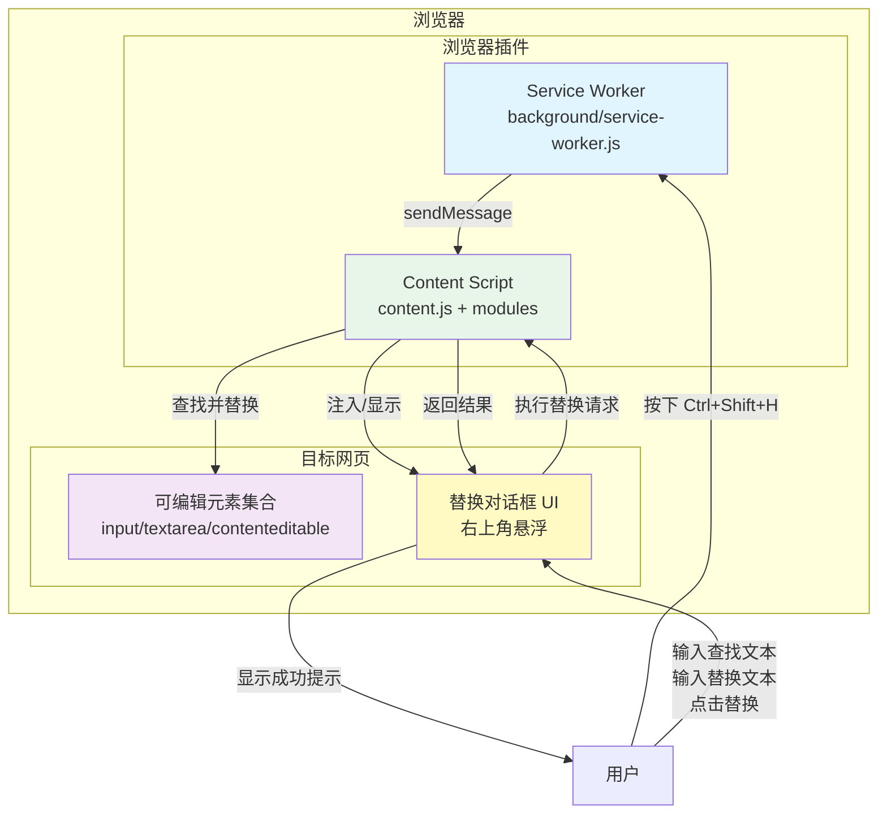
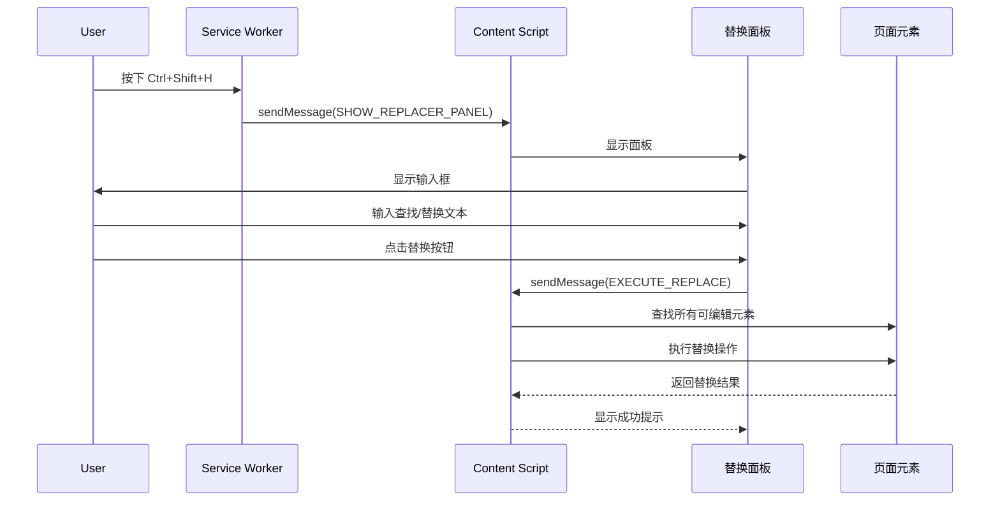

# 文本替换浏览器插件 - 架构设计文档

## 项目概述

基于 Manifest V3 开发的浏览器插件，通过 Ctrl+Shift+H 快捷键触发，在网页右上角弹出对话框，实现对所有可编辑文本元素的全局查找替换功能。

## 功能需求

1. **快捷键触发**：Ctrl+Shift+H 激活替换对话框
2. **全局替换**：对页面上所有可编辑元素执行替换，而非仅聚焦元素
3. **可编辑元素类型**：
   - `<input type="text">`
   - `<textarea>`
   - `contenteditable` 元素
   - 其他可输入类型（email, search, url, password 等）

## 项目目录结构

```
text-replacer-extension/
├── manifest.json              # Manifest V3 配置文件
├── icons/                     # 插件图标
│   ├── icon16.png
│   ├── icon32.png
│   ├── icon48.png
│   ├── icon64.png
│   └── icon128.png
├── src/
│   ├── background/            # 后台服务
│   │   └── service-worker.js  # Service Worker (替代 background page)
│   ├── content/               # 内容脚本
│   │   ├── content.js         # 主内容脚本入口
│   │   ├── element-finder.js  # 可编辑元素查找器
│   │   ├── text-replacer.js   # 文本替换核心逻辑
│   │   └── ui-injector.js     # UI 对话框注入器
│   ├── popup/                 # 弹出窗口（如有需要）
│   │   ├── popup.html
│   │   ├── popup.js
│   │   └── popup.css
│   ├── styles/                # 样式文件
│   │   └── replacer-panel.css # 替换面板样式
│   └── utils/                 # 工具模块
│       ├── constants.js       # 常量定义
│       └── logger.js          # 日志工具
└── README.md                  # 项目说明文档
```

## 核心架构设计

### 系统架构图



### 模块设计

#### 1. Service Worker (`src/background/service-worker.js`)

**职责**：
- 监听全局快捷键命令
- 向当前标签页的 content script 发送消息

**核心代码结构**：
```javascript
// 监听命令
chrome.commands.onCommand.addListener((command) => {
  if (command === 'toggle-replacer') {
    // 获取当前活动标签页并发送消息
    chrome.tabs.query({active: true, currentWindow: true}, (tabs) => {
      chrome.tabs.sendMessage(tabs[0].id, {action: 'SHOW_REPLACER_PANEL'});
    });
  }
});
```

#### 2. Content Script (`src/content/content.js`)

**职责**：
- 消息中心：接收来自 background 的消息
- 协调各模块完成功能

**核心代码结构**：
```javascript
// 监听消息
chrome.runtime.onMessage.addListener((message, sender, sendResponse) => {
  switch(message.action) {
    case 'SHOW_REPLACER_PANEL':
      uiInjector.showPanel();
      break;
    case 'EXECUTE_REPLACE':
      const result = textReplacer.replaceAll(message.findText, message.replaceText);
      sendResponse(result);
      break;
    case 'HIDE_REPLACER_PANEL':
      uiInjector.hidePanel();
      break;
  }
});
```

#### 3. 元素查找器 (`src/content/element-finder.js`)

**职责**：
- 查找页面上所有可编辑元素

**查找策略**：
```javascript
function findAllEditableElements() {
  const selectors = [
    'input[type="text"]',
    'input[type="search"]',
    'input[type="email"]',
    'input[type="url"]',
    'input:not([type])',  // 默认 type 为 text
    'textarea',
    '[contenteditable="true"]',
    '[contenteditable=""]'  // 空值等同于 true
  ];
  
  return Array.from(document.querySelectorAll(selectors.join(', ')));
}
```

#### 4. 文本替换器 (`src/content/text-replacer.js`)

**职责**：
- 执行全局文本替换
- 返回替换统计结果

**核心逻辑**：
```javascript
function replaceAll(findText, replaceText) {
  const elements = elementFinder.findAllEditableElements();
  let stats = {total: 0, replaced: 0, elements: 0};
  
  elements.forEach(element => {
    const currentValue = getElementValue(element);
    if (currentValue.includes(findText)) {
      const newValue = currentValue.replaceAll(findText, replaceText);
      setElementValue(element, newValue);
      stats.replaced++;
    }
    stats.total++;
  });
  
  return stats;
}

function getElementValue(element) {
  if (element.isContentEditable) {
    return element.innerText;
  }
  return element.value;
}

function setElementValue(element, value) {
  if (element.isContentEditable) {
    element.innerText = value;
  } else {
    element.value = value;
  }
}
```

#### 5. UI 注入器 (`src/content/ui-injector.js`)

**职责**：
- 创建替换面板 DOM
- 显示/隐藏面板
- 处理面板交互事件

**UI 结构**：
```html
<div id="text-replacer-panel" class="tr-panel hidden">
  <div class="tr-header">
    <span class="tr-title">文本替换</span>
    <button class="tr-close">×</button>
  </div>
  <div class="tr-body">
    <div class="tr-input-group">
      <label>查找文本</label>
      <input type="text" id="tr-find-input" placeholder="输入要查找的文本...">
    </div>
    <div class="tr-input-group">
      <label>替换为</label>
      <input type="text" id="tr-replace-input" placeholder="输入替换后的文本...">
    </div>
    <div class="tr-stats" id="tr-stats"></div>
    <div class="tr-actions">
      <button id="tr-replace-btn" class="tr-btn-primary">替换</button>
      <button id="tr-cancel-btn" class="tr-btn-secondary">取消</button>
    </div>
  </div>
</div>
```

### 通信机制



### 样式设计要点

1. **定位**：固定定位在右上角
2. **z-index**：高 z-index 确保在最上层
3. **阴影隔离**：使用 Shadow DOM 或高 z-index 避免被页面样式污染
4. **响应式**：适配不同屏幕尺寸

```css
.tr-panel {
  position: fixed;
  top: 20px;
  right: 20px;
  width: 320px;
  background: #ffffff;
  border-radius: 8px;
  box-shadow: 0 4px 20px rgba(0, 0, 0, 0.15);
  z-index: 2147483647;  /* 最大 32-bit 整数 */
  font-family: -apple-system, BlinkMacSystemFont, 'Segoe UI', Roboto, sans-serif;
}

.tr-panel.hidden {
  display: none;
}
```

## Manifest V3 配置

```json
{
  "manifest_version": 3,
  "name": "文本替换助手",
  "version": "1.0.0",
  "description": "通过 Ctrl+Shift+H 快捷键，对网页所有可编辑元素执行全局文本替换",
  "permissions": [
    "activeTab",
    "scripting"
  ],
  "background": {
    "service_worker": "src/background/service-worker.js"
  },
  "commands": {
    "toggle-replacer": {
      "suggested_key": {
        "default": "Ctrl+Shift+H",
        "mac": "Command+Shift+H"
      },
      "description": "打开/关闭文本替换面板"
    }
  },
  "content_scripts": [
    {
      "matches": ["<all_urls>"],
      "js": ["src/content/content.js"],
      "run_at": "document_idle"
    }
  ],
  "icons": {
    "16": "icons/icon16.png",
    "32": "icons/icon32.png",
    "48": "icons/icon48.png",
    "64": "icons/icon64.png",
    "128": "icons/icon128.png"
  }
}
```

## 边界情况处理

| 场景 | 处理方式 |
|------|----------|
| 查找文本为空 | 禁用替换按钮，显示提示 |
| 未找到匹配 | 显示"未找到匹配文本" |
| 元素被隐藏/禁用 | 跳过这些元素，仅处理可交互元素 |
| contenteditable 元素 | 使用 innerText/innerHTML 处理 |
| 动态加载的元素 | 使用 MutationObserver 监听（可选） |
| iframe 中的元素 | 需要额外注入 content script（高级功能） |

## 开发步骤建议

1. 创建基础项目结构和 manifest.json
2. 实现 service-worker 快捷键监听
3. 实现内容脚本通信机制
4. 实现 UI 面板和样式
5. 实现元素查找逻辑
6. 实现替换核心逻辑
7. 测试各种网页场景
8. 优化用户体验

## 测试场景

- 普通文本输入框
- 多行文本域
- 富文本编辑器（contenteditable）
- 登录表单
- 搜索框
- 包含多个输入框的表单
- 动态生成的输入框
